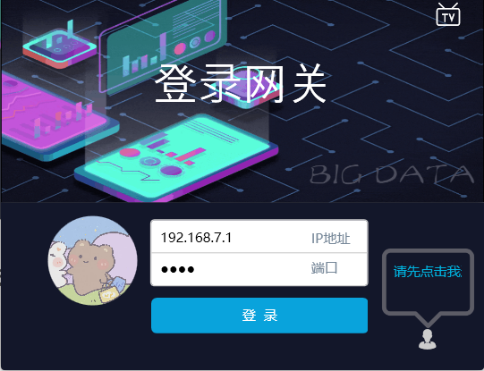
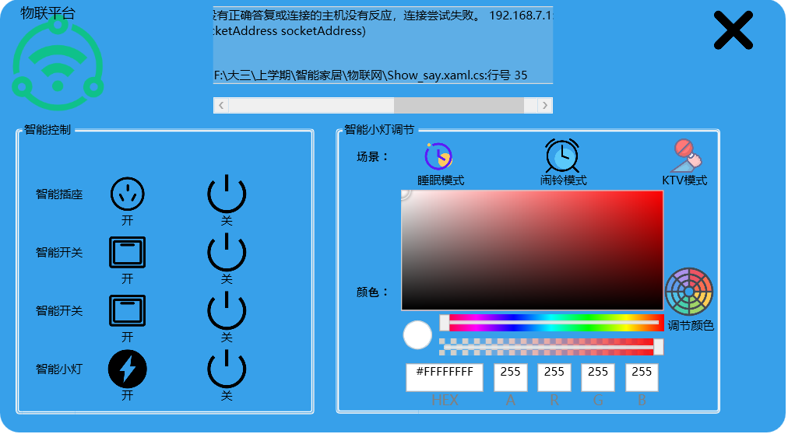

---

## 适用于本人学校的创新实践项目的智能家居

---

前提思想：网关为两个协议栈，通过网线接收控制命令，通过zigbee向室内的物联网工具（这里是小灯）发送指令协作。这里使用C#开发，使用socket类连接网关，向网关发送二进制指令。
指令是根据开发手册中的数据结构进行开发构造（见本项目根目录《飞瑞敖智能家居设备通信协议》） 

---

## 登陆界面——模仿QQ制作登陆界面
### 账号验证界面

### 网关登陆界面

### 主界面

